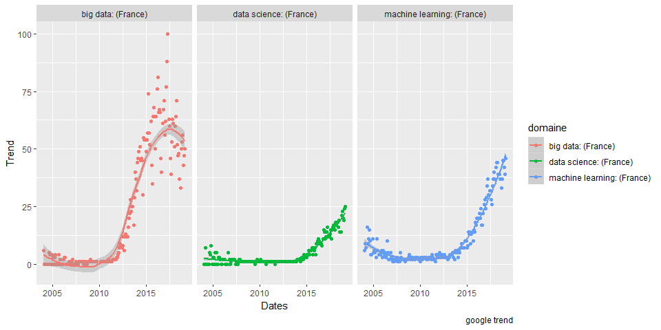

Cours de Data Science avec R
================

Ce répertoire contient les notes de cours de la suite du cours FIN403

## Syllabus

Le mot “data science” est devenu à la mode depuis quelques années.
L’objectif du cours est de vous familiarisez avec ce nouveau domaine à
la convergence d’autres champs différents : synergie de l’informatique,
math, stat., visualisation, analyse de données, expertise métiers…. Ce
cours est la suite naturelle du cours de Fin403 en Master 1. Nous
utiliserons le logiciel R, qui est un puissant outil d’analyse de
données et de statistiques.

    ## # A tibble: 6 x 3
    ## # Groups:   Mois [6]
    ##   Mois    domaine                trend
    ##   <chr>   <chr>                  <chr>
    ## 1 2004-01 data science: (France) 0    
    ## 2 2004-02 data science: (France) 0    
    ## 3 2004-03 data science: (France) 7    
    ## 4 2004-04 data science: (France) 0    
    ## 5 2004-05 data science: (France) 0    
    ## 6 2004-06 data science: (France) 0

<!-- -->
